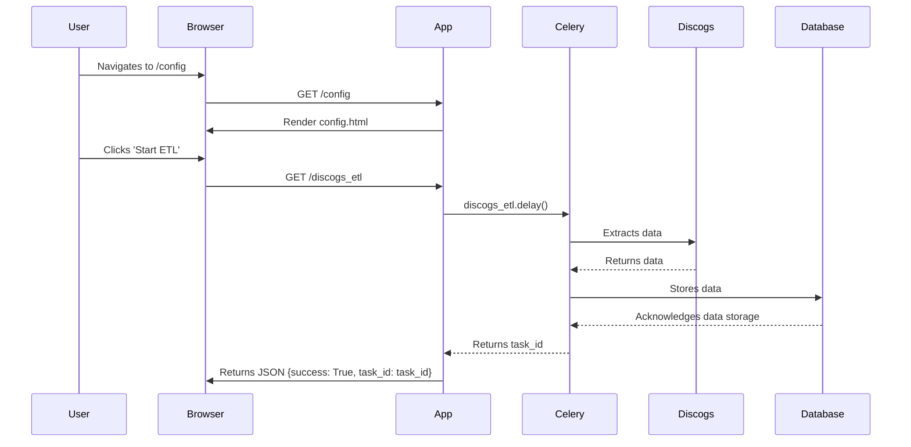
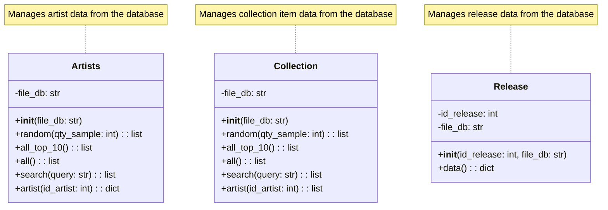

# Web App

The app is a Flask web application for exploring a music collection. It integrates with Discogs API for data extraction and uses Celery for asynchronous task management. The application allows users to browse their music collection by artists, releases, and individual items. It also provides features for searching, viewing details, and managing Discogs credentials. The application supports offline viewing via a service worker and manifest file.

## Key Components

* **Flask App (```app```)**: The core Flask application instance, handling routing and rendering of HTML templates. It defines routes for various pages like home, artists, collection items, configuration, and about.
* **Discogs Integration (```discogs```)**: An instance of the ```Discogs``` class, responsible for interacting with the Discogs API. This includes handling user authentication, retrieving data, and managing API credentials.
* **Celery Integration (```celery_app```)**: Used for asynchronous tasks, primarily the Discogs ETL (Extract, Transform, Load) process. Tasks are managed and their status can be checked via specific routes.
* **Data Access Objects**: Classes like ```Artists```, ```Collection```, and ```Release``` provide an abstraction layer for interacting with the database (DuckDB, based on the ```file_db``` configuration). These classes offer methods for retrieving data based on various criteria (e.g., random samples, top 10, searching).
* **Routing**: The ```@app.route``` decorator defines various URL endpoints and their corresponding handler functions. These routes handle different aspects of the application, such as displaying artists, collection items, search results, and managing the Discogs ETL process.
* **Templating**: Uses Jinja2 templates (located in the ```templates``` directory) to dynamically generate HTML pages.
* **Configuration**: Reads configuration parameters from a YAML file (```config/config.yml```), including the database file path and application URL.
* **Offline Support**: Includes routes and files (```manifest.json```, ```service-worker.js```, ```offline.html```) to enable Progressive Web App (PWA) functionality, allowing offline access to the application.

## Sequence for the Discogs ETL process



# Class diagram for Artists and Collection


