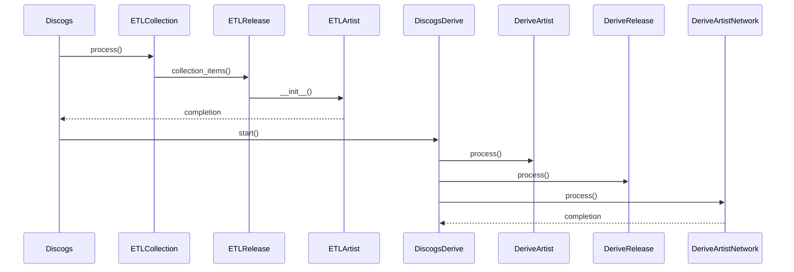
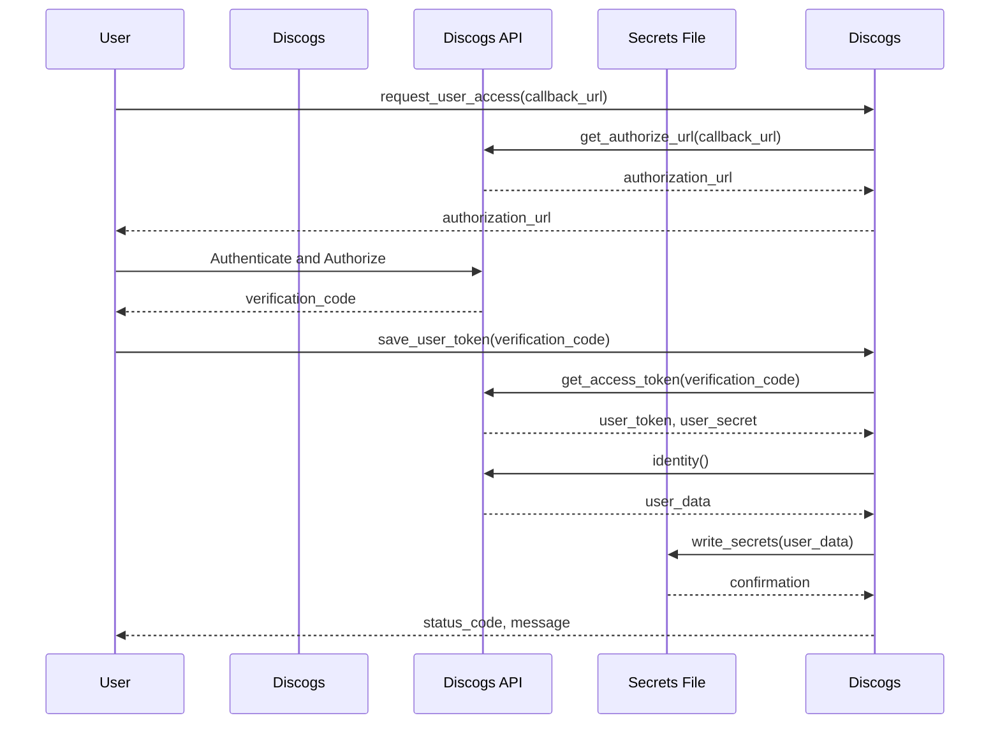
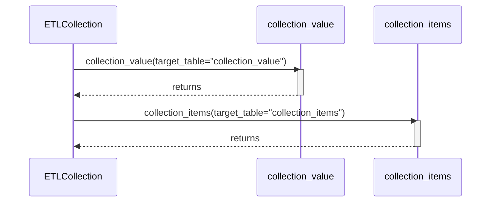
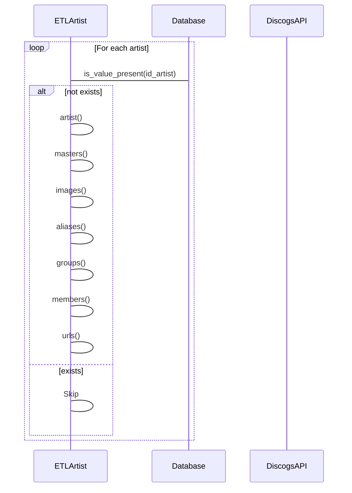
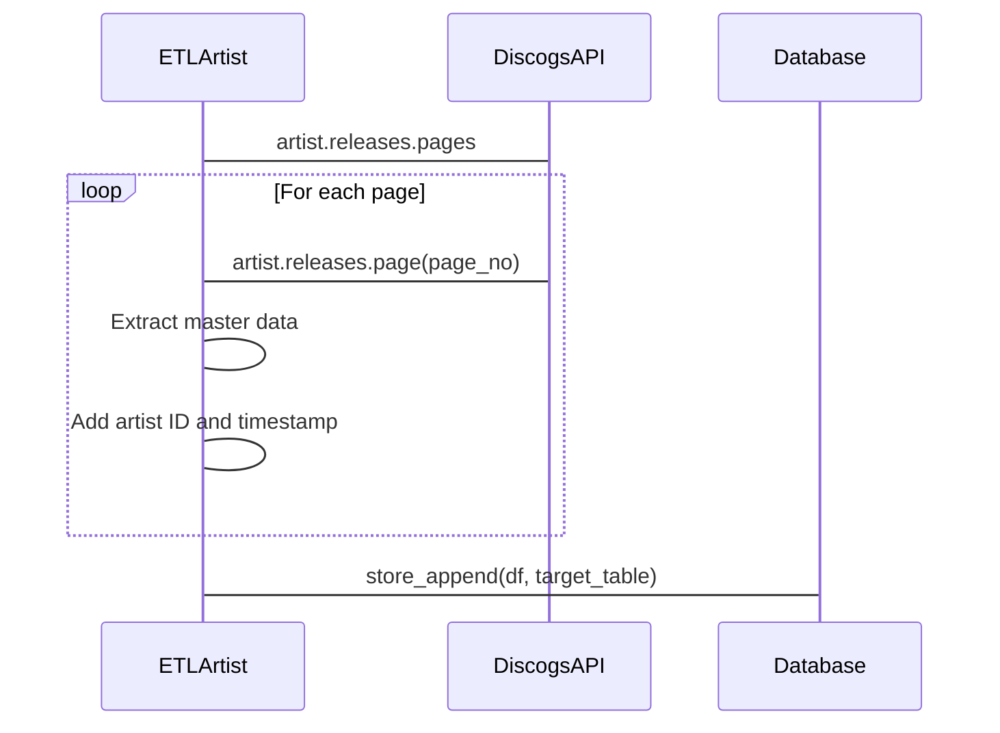
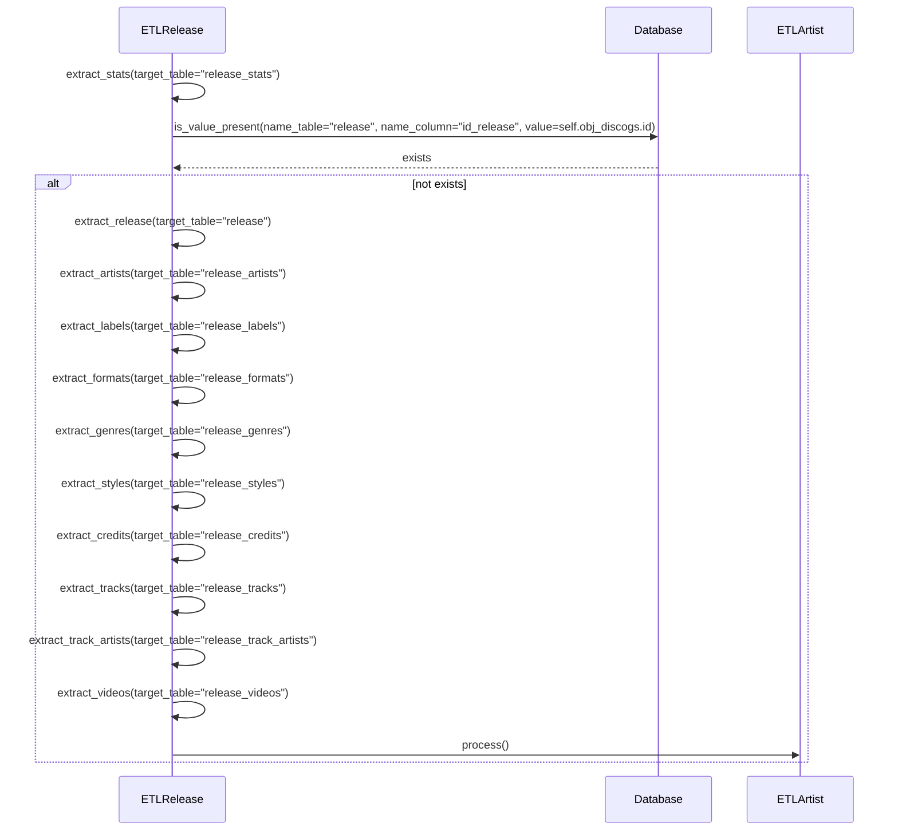

# Discogs extractor

**```discogs.py```** manages interaction with the Discogs API for extracting and processing music collection data. It handles user authentication, including token management and initiating the Extract, Transform, Load (ETL) process for fetching and storing collection details in a database.

 **```extractor_collection.py```** defines the ```ETLCollection``` class, which is responsible for extracting, transforming, and loading (ETL) data related to a user's Discogs record collection. It interacts with the Discogs API to fetch collection data, processes it, and stores it in a local database. The ETL process covers collection value statistics (minimum, median, maximum) and detailed information about each item in the collection, including release details. It uses Celery for asynchronous task management and Polars for data manipulation.


```mermaid
sequenceDiagram
    participant Discogs
    participant ETLCollection
    participant ETLRelease
    participant ETLArtist
    participant DiscogsDerive
    participant DeriveArtist
    participant DeriveRelease
    participant DeriveArtistNetwork

    Discogs->>ETLCollection: process()
    ETLCollection->>ETLRelease: collection_items()
    ETLRelease->>ETLArtist: __init__()
    ETLArtist-->>Discogs: completion
    Discogs->>DiscogsDerive: start()
    DiscogsDerive->>DeriveArtist: process()
    DiscogsDerive->>DeriveRelease: process()
    DiscogsDerive->>DeriveArtistNetwork: process()
    DeriveArtistNetwork-->>DiscogsDerive: completion
```

## Sequence diagrams

### Discogs Authentication


```mermaid
sequenceDiagram
    participant User
    participant DiscogsClass as Discogs
    participant DiscogsAPI as Discogs API
    participant SecretsFile as Secrets File

    User->>Discogs: request_user_access(callback_url)
    Discogs->>DiscogsAPI: get_authorize_url(callback_url)
    DiscogsAPI-->>Discogs: authorization_url
    Discogs-->>User: authorization_url

    User->>DiscogsAPI: Authenticate and Authorize
    DiscogsAPI-->>User: verification_code

    User->>Discogs: save_user_token(verification_code)
    Discogs->>DiscogsAPI: get_access_token(verification_code)
    DiscogsAPI-->>Discogs: user_token, user_secret
    Discogs->>DiscogsAPI: identity()
    DiscogsAPI-->>Discogs: user_data
    Discogs->>SecretsFile: write_secrets(user_data)
    SecretsFile-->>Discogs: confirmation
    Discogs-->>User: status_code, message
```

### ETLCollection process


```mermaid
sequenceDiagram
    participant ETLCollection
    participant collection_value
    participant collection_items

    ETLCollection->>collection_value: collection_value(target_table="collection_value")
    activate collection_value
    collection_value-->>ETLCollection: returns
    deactivate collection_value
    ETLCollection->>collection_items: collection_items(target_table="collection_items")
    activate collection_items
    collection_items-->>ETLCollection: returns
    deactivate collection_items
```

#### ETLCollection Collection items

```mermaind
sequenceDiagram
    participant ETLCollection
    participant User
    participant CollectionFolder
    participant ETLRelease

    ETLCollection->>User: user.collection_folders[0].count
    activate User
    User-->>ETLCollection: returns qty_items
    deactivate User
    ETLCollection->>CollectionFolder: user.collection_folders[0].releases
    activate CollectionFolder
    CollectionFolder-->>ETLCollection: returns lst_releases
    deactivate CollectionFolder
    loop for each item in lst_releases
        ETLCollection->>ETLCollection: _collection_item(collection_item=item, target_table=target_table)
        activate ETLCollection
        ETLCollection->>ETLRelease: release = ETLRelease(collection_item.release, file_db=self.file_db)
        ETLCollection->>ETLRelease: release.process()
        deactivate ETLCollection
    end
```

### ETLArtist

```extractor_artist.py``` defines the ```ETLArtist``` class, which is responsible for extracting, transforming, and loading (ETL) artist data from the Discogs API. It retrieves various information about artists, such as their profile, master releases, images, aliases, groups, members, and URLs, and stores it in a database. The class uses the discogs_client library to interact with the Discogs API and polars for data manipulation. It also integrates with Celery for task management and logging for status updates.

Processing Artists


```mermaid
sequenceDiagram
    participant ETLArtist
    participant Database
    participant DiscogsAPI

    loop For each artist
        ETLArtist->Database: is_value_present(id_artist)
        alt not exists
            ETLArtist->ETLArtist: artist()
            ETLArtist->ETLArtist: masters()
            ETLArtist->ETLArtist: images()
            ETLArtist->ETLArtist: aliases()
            ETLArtist->ETLArtist: groups()
            ETLArtist->ETLArtist: members()
            ETLArtist->ETLArtist: urls()
        else exists
            ETLArtist->ETLArtist: Skip
        end
    end
```

#### Processing artist masters


```mermaid
sequenceDiagram
    participant ETLArtist
    participant DiscogsAPI
    participant Database

    ETLArtist->DiscogsAPI: artist.releases.pages
    loop For each page
        ETLArtist->DiscogsAPI: artist.releases.page(page_no)
        ETLArtist->ETLArtist: Extract master data
        ETLArtist->ETLArtist: Add artist ID and timestamp
    end
    ETLArtist->Database: store_append(df, target_table)
```

### ETLMaster

 ```extractor_master.py``` defines the ```ETLMaster``` class, which is responsible for extracting, transforming, and loading (ETL) data for Discogs master releases into a database. It handles various aspects of a master release, including general information, statistics, genres, styles, tracks, track artists, and videos. The class uses the ```discogs_client``` library to interact with the Discogs API and ```polars``` for data manipulation. It also integrates with Celery for task management. The ETL process is designed to avoid redundant data extraction by checking if a master release has already been processed.

 Processing masters

 ```mermaid
 sequenceDiagram
  participant ETLMaster
  participant Database as DB

  ETLMaster->>ETLMaster: extract_stats(target_table="master_stats")
  ETLMaster->>DB: is_value_present(name_table="master", name_column="id_master", value=self.obj_discogs.id)
  DB-->>ETLMaster: exists: bool
  alt not exists
    ETLMaster->>ETLMaster: master()
    ETLMaster->>ETLMaster: extract_genres(target_table="master_genres")
    ETLMaster->>ETLMaster: extract_styles(target_table="master_styles")
    ETLMaster->>ETLMaster: extract_tracks(target_table="master_tracks")
    ETLMaster->>ETLMaster: extract_track_artists(target_table="master_track_artists")
    ETLMaster->>ETLMaster: extract_videos(target_table="master_videos")
  else exists
    ETLMaster->>ETLMaster: Skip extraction
  end
 ```

 ### ETLRelease

```extractor_release.py``` defines the ```ETLRelease``` class, which is responsible for extracting, transforming, and loading (ETL) data for music releases from the Discogs API. It retrieves comprehensive information about each release, including details about the release itself, artists, labels, formats, genres, styles, credits, tracks, videos, and marketplace statistics. The extracted data is then stored in a database. This class interacts with other ETL classes, like ```ETLArtist``` and ```ETLMaster```, suggesting a modular design for the data extraction pipeline.


```mermaid
sequenceDiagram
    participant ETLRelease
    participant Database
    participant ETLArtist

    ETLRelease->>ETLRelease: extract_stats(target_table="release_stats")
    ETLRelease->>Database: is_value_present(name_table="release", name_column="id_release", value=self.obj_discogs.id)
    Database-->>ETLRelease: exists
    alt not exists
        ETLRelease->>ETLRelease: extract_release(target_table="release")
        ETLRelease->>ETLRelease: extract_artists(target_table="release_artists")
        ETLRelease->>ETLRelease: extract_labels(target_table="release_labels")
        ETLRelease->>ETLRelease: extract_formats(target_table="release_formats")
        ETLRelease->>ETLRelease: extract_genres(target_table="release_genres")
        ETLRelease->>ETLRelease: extract_styles(target_table="release_styles")
        ETLRelease->>ETLRelease: extract_credits(target_table="release_credits")
        ETLRelease->>ETLRelease: extract_tracks(target_table="release_tracks")
        ETLRelease->>ETLRelease: extract_track_artists(target_table="release_track_artists")
        ETLRelease->>ETLRelease: extract_videos(target_table="release_videos")
        ETLRelease->>ETLArtist: process()
    end
```
