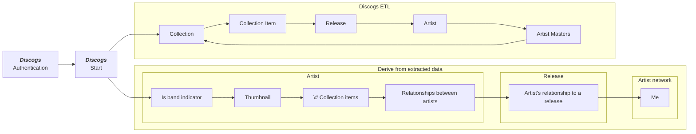
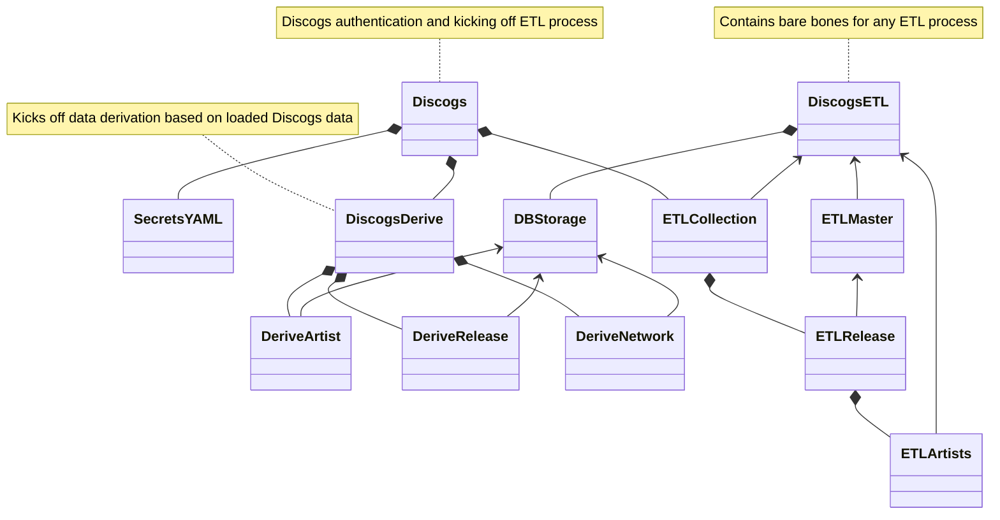
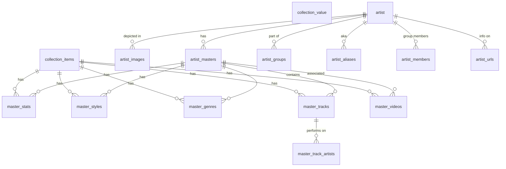
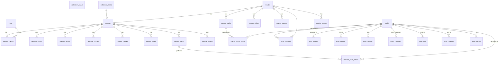
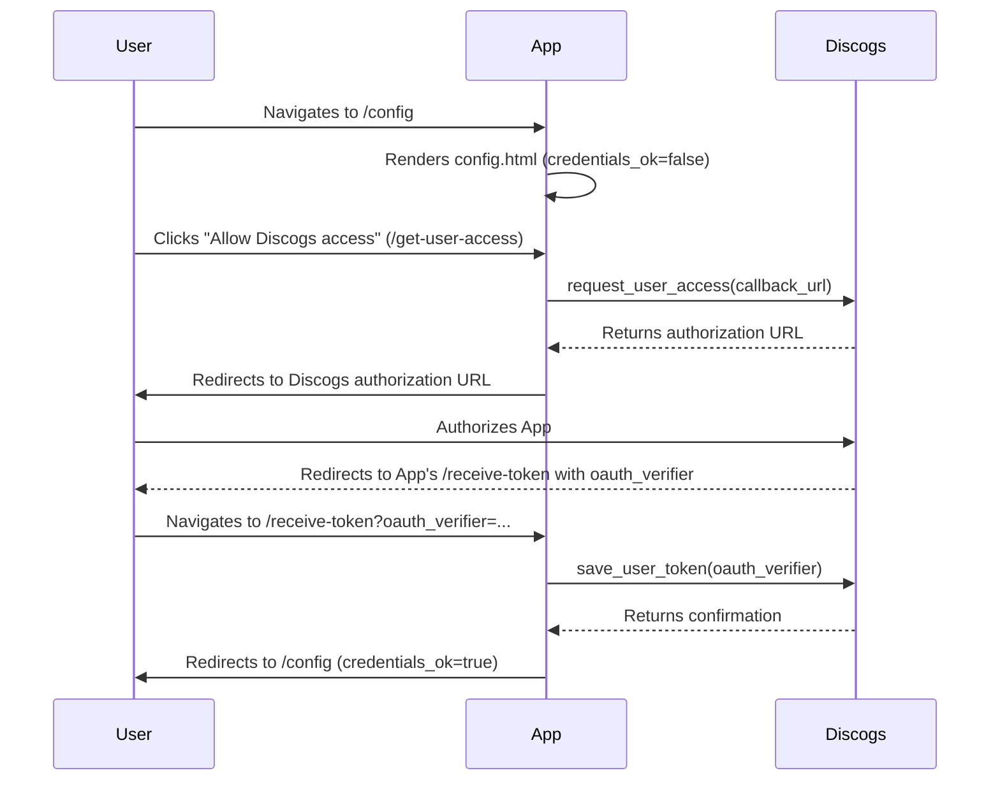

# Discogs ETL

## Data extraction and enrichment process

To create insights from your music collection, first the data needs to be extracted from Discogs and stored in a database. The first step in this process is allowing the script to extract your data by using an authentication mechanism. Then we kick of the data collection part that is described below in the _Discogs ETL_ section. After this extraction process,

## Class diagram

To achieve the extraction and deriving information process described above the following classes are implemented.

## Storage diagram

This section describes the data storage in a diagram.

## Discogs authentication flow

